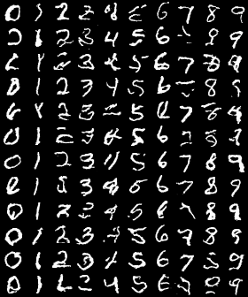
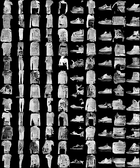

## Implementation of a Conditional PixelCNN using Gated Convolutional Layers [1] 

- based on [jzbontar/pixelcnn-pytorch](https://github.com/jzbontar/pixelcnn-pytorch)

Samples from the model after 25 epochs:

|         MNIST                       |         Fashion-MNIST                |
|:-----------------------------------:|:------------------------------------:|
|  | |

### References

[1] Van den Oord, Aaron, et al. "Conditional image generation with pixelcnn decoders." Advances in neural information processing systems. 2016.
